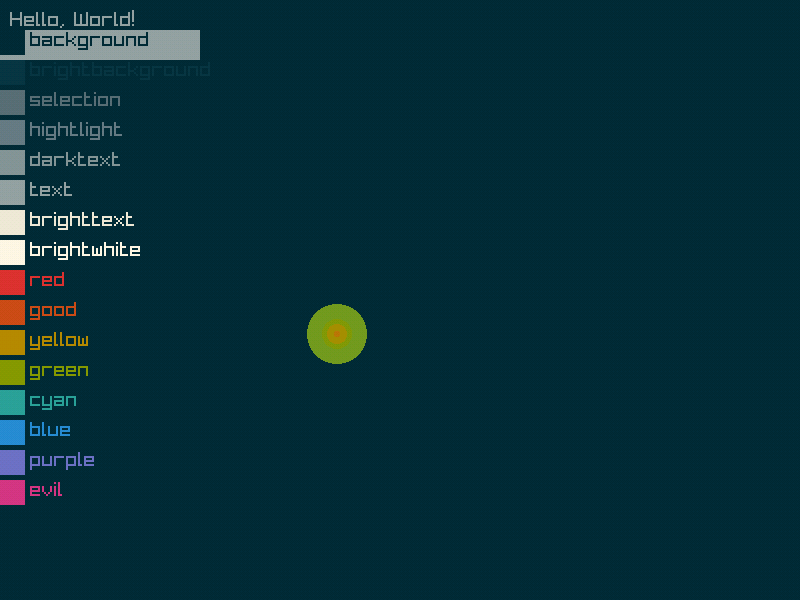
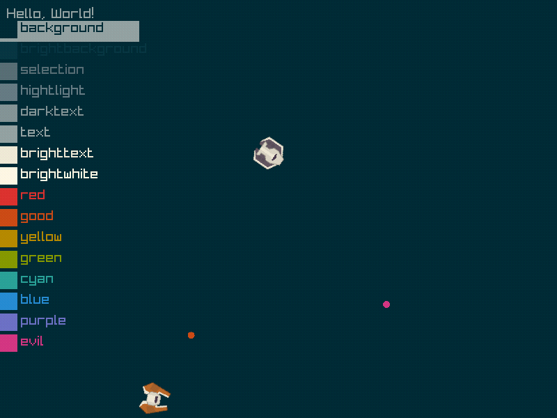
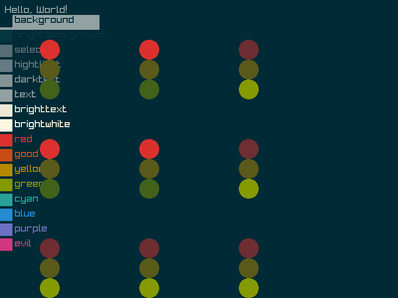
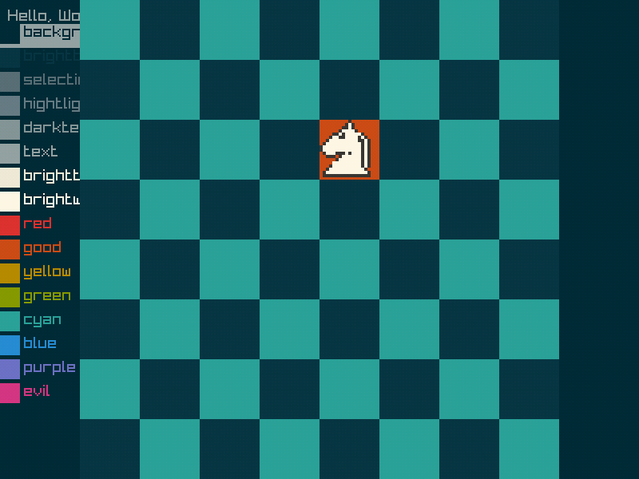

Recreation of my lerplist demos as "machines" rather then "ranges", plus a undoable knight with extermely lazy animation

Note that raylib records at /5 the frame rate, the lack of smoothness is a an artifact of that

Still messy, but Im kinda just biulding up piles of code to let the idea take shape.